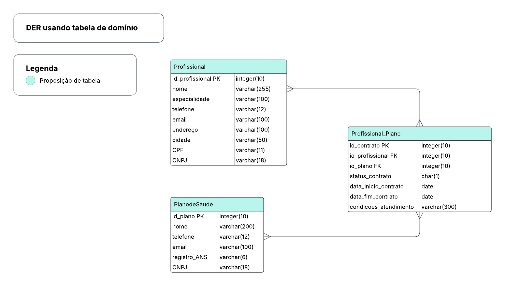
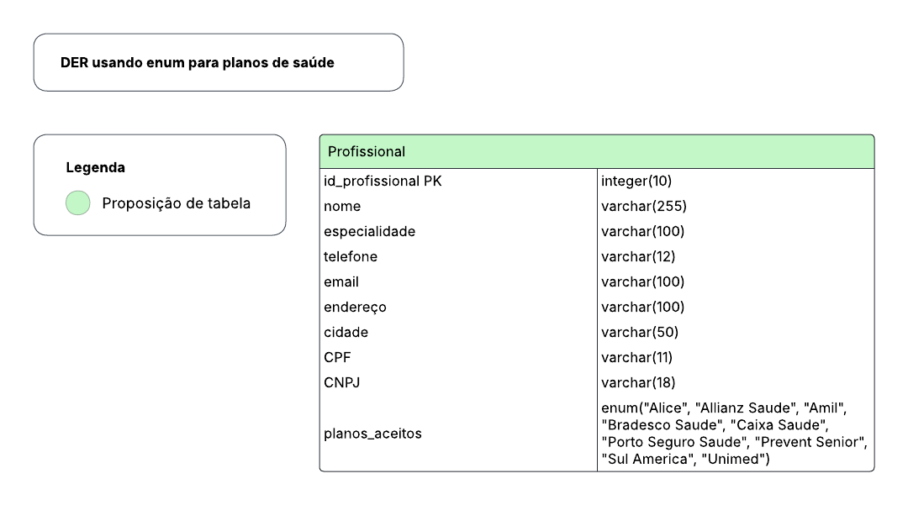

# Desafio Técnico Lacrei Saúde

O objetivo desse desafio foi modelar e implementar uma estrutura de base de dados de profissionais da saúde e planos de saúde para o projeto social Lacrei Saúde.

O projeto foi desenvolvido aplicando duas abordagens diferentes: a primeira proposta, usando tabela de domínio e a segunda, usando enum.

## Proposta 1 
1) <ins>Modelagem de dados</ins>
    
    A proposta 1 envolve a modelagem de dados utilizando três entidades ou tabelas: uma tabela contendo o identificador do profissional de saúde e seus atributos; uma segunda tabela contendo o identificador do plano de saúde e seus atributos; e uma terceira fazendo a relação entre um profissional de saúde e um plano de saúde, criando um identificador do contrato entre eles e contendo outras informações necessárias nesse contexto.

2) <ins>DER</ins>
    
    
   
3) <ins>Dicionário de dados</ins>
   
    No arquivo pdf localizado no repositório *modelagem* podem ser encontradas mais informações sobre os atributos de cada tabela do DER referente a essa proposta.
   
4) <ins>Vantagens e desvantagens</ins>

    A principal vantagem dessa abordagem é a facilidade de manutenção da base de dados, cadastrando novos planos na tabela referente aos planos de saúde. Além disso, a garantia de relacionamentos consistentes entre as três tabelas devido ao uso de chaves estrangeiras (*foreign key* ou *FK*) é essencial para que não sejam adicionados profissionais ou planos de saúde duplicados, por exemplo. Ademais, a facilidade em realizar as buscas na base de dados, como quais planos um profissional de saúde aceita ou quais profissionais aceitam um plano de saúde específico.
  
    Em relação às desvantagens, é preciso destacar a necessidade de três tabelas diferentes nessa proposta, o que pode representar um peso significativo para a base de dados, aumentando os custos de armazenamento da mesma. Essa estrutura também faz com que a manutenção seja um pouco mais complexa do que apenas salvar os planos de saúde direto em um campo de uma só tabela.

5) <ins>Scripts</ins>

    Os scripts para criação das tabelas e índices podem ser encontrados no repositório *scripts*.

## Proposta 2

1) <ins>Modelagem de dados</ins>
    
    A proposta 2 envolve a modelagem de dados utilizando uma tabela referente aos profissionais de saúde, contendo o identificador do profissional e seus atributos, dos quais um deles é um campo designado aos planos de saúde que esse profissional aceita. Esse campo é do tipo enum e contém dados em texto (*string*) com os planos aceitos pelo profissional; no entanto, esses dados são decodificados como números.

2) <ins>DER</ins>
    
    
   
3) <ins>Dicionário de dados</ins>
   
    No arquivo pdf localizado no repositório *modelagem* podem ser encontradas mais informações sobre os atributos de cada tabela do DER referente a essa proposta.
   
4) <ins>Vantagens e desvantagens</ins>

    A principal vantagem da proposta 2 é a simplicidade da estrutura da base de dados contendo apenas uma tabela, além de a estrutura ENUM necessitar de 1/6 do espaço de armazenamento de um dado de tipo *string*. A inserção de novos profissionais de saúde na base também é facilitada, pois não é necessário atualizar a tabela de profissionais de saúde e a tabela de domínio.

   Quanto às desvantagens deve-se destacar a limitação de escalabilidade e a maior complexidade para utilizar filtros como profissionais para um plano de saúde específico quando utilizada a estrutura ENUM. Dificuldades também podem surgir ao utilizar números, quando é necessário ordenar os valores contidos no ENUM e quando é necessário inserir um novo plano de saúde na tabela.
   
5) <ins>Scripts</ins>

    Os scripts para criação das tabelas e índices podem ser encontrados no repositório *scripts*.

## Reflexão sobre uso de `jsonb`

`jsonb` é um tipo de dado desenvolvido para armazenar dados do tipo JSON em um formato binário otimizado e decomposto. Dados do tipo JSON se assemelham a um dicionário da linguagem de código Python, permitindo o armazenamento de dados complexos, mas ainda assim estruturados e unidos. Dessa forma, o uso desse tipo de estrutura no contexto do desafio seria adequado na **proposta 1**. 
    
Na tabela de domínio, na qual se faz a relação entre os profissionais de saúde e os planos, existe o campo *condicoes_atendimento*, onde poderiam ficar armazenadas múltiplas informações, como limite de consultas, horário de atendimeno e observações. No repositório *scripts*, podem ser encontrados o script para a criação do atributo `jsonb` e a inserção de dados.

## Comparação entre as duas propostas

A **proposta 1** adota uma estrutura mais normalizada, distribuindo os dados em três tabelas (profissionais, planos e relacionamento entre eles), enquanto a estrutura da **proposta 2** concentra todos os dados em uma única tabela e os nomes dos planos de saúde em um campo ENUM, o que torna a estrutura mais desnormalizada do que a abordagem com tabela de domínio.

Quanto à flexibilidade e escalabilidade, aplicando-se a **proposta 1**, é possível adicionar novos planos apenas inserindo registros na tabela correspondente, sem impactar o esquema do banco. Na **proposta 2**, cada novo plano exige alteração no ENUM, ou seja, é necessário modificar o esquema do banco para adicionar novos planos. Essa modificação exige *migrations* e pode afetar consultas existentes.

Em relação à consistência e integridade dos dados, a **proposta 1** garante maior confiabilidade do que a **proposta 2**, já que utiliza chaves estrangeiras, evitando duplicações e assegurando relacionamentos corretos. A segunda abordagem, por depender do ENUM, não oferece o mesmo nível de controle e pode gerar dificuldades no gerenciamento dos valores.

Finalmente, a **proposta 1** facilita buscas complexas, como identificação de todos os planos aceitos por um profissional ou todos os profissionais vinculados a determinado plano, mesmo que dependa de JOIN. Já na **proposta 2**, as consultas são mais diretas por todos os dados estarem em uma única tabela. Contudo as buscas são menos eficientes e flexíveis, principalmente quando se deseja filtrar por planos específicos.

Dessa forma, a conclusão desse desafio é que a **proposta 1** é a mais adequada, já que o objetivo do Lacrei Saúde é ter uma base de dados com uma quantidade considerável de profissionais de saúde e gerir de forma eficiente a quais planos de saúde esses profissionais estão ligados atualmente. Ainda assim, se a ideia for apenas testar de forma rápida, como em um protótipo ou MVP, a **proposta 2** pode ser válida.

## Governança de dados e LGPD

Seguem os pontos a serem considaderados para:

1) Governança de Dados  
- Definição de pessoas responsáveis na utilização e gestão dos dados  
- Políticas claras aos usuários de acesso, correção e exclusão de dados  
- Auditoria, monitoramento e documentação para garantir transparência  
- Uso ético e responsável das informações  

2) LGPD  
- Coleta apenas dos dados estritamente necessários
- Consentimento informado dos usuários para uso de dados
- Proteção de informações sensíveis (anonimização e segurança)
- Políticas de retenção para evitar armazenamento desnecessário
- Garantia dos direitos dos usuários: acesso, correção e exclusão
